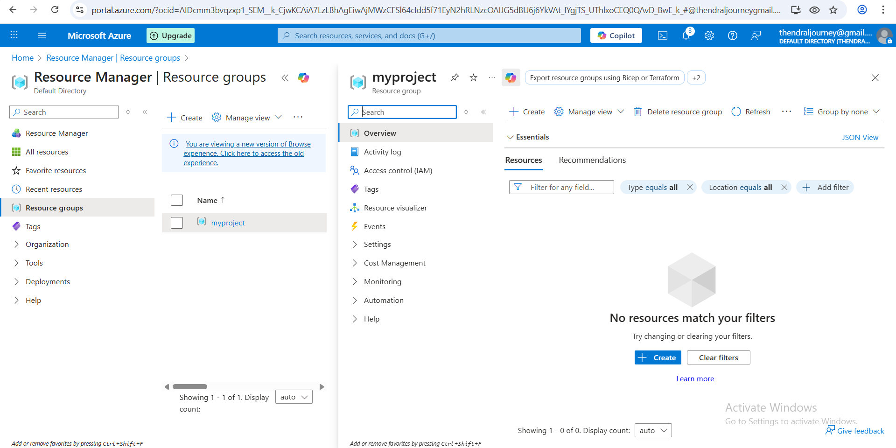
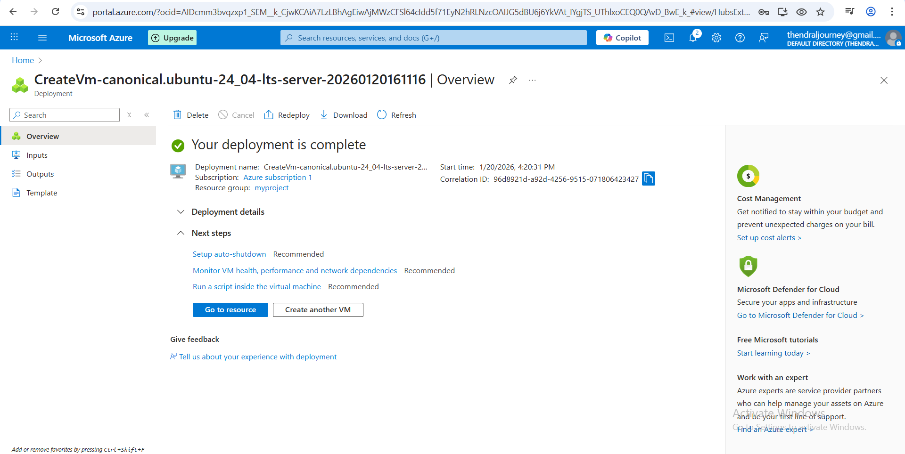
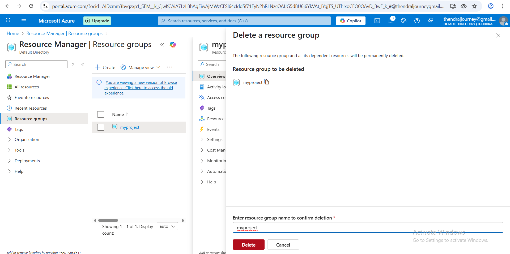

# Azure Basics Projects ☁️

This repository contains beginner-level Azure cloud projects created using the Azure Portal.

## Project 1: Create Resource Group and Virtual Machine

### Create Resource Group (Azure Portal)

Login to https://portal.azure.com

Search Resource groups

Click Create

Subscription: Azure subscription 1

Resource group name: myproject

Region: Central India

Click Review + Create

Click Create

✅ Resource Group created

### Create Virtual Machine

In Azure Portal → Search Virtual Machines

Click Create → Azure Virtual Machine

Subscription: Azure subscription 1

Resource group: rg-azure-basics

Virtual machine name: vm22

Region: Central India

Image: Ubuntu Server 24.04 LTS-Gen 2

Size: Standard B2ats v2

Username: azure

Next → Review + Create

Click Create

✅ Virtual Machine created

### Steps Performed

1. Logged into Azure Portal
2. Created a Resource Group named `myproject`
3. Created a Virtual Machine named `vm22`
4. Verified VM running status

### Screenshots

### Resource Group Created

### Virtual Machine Created

### VM Running

### Stop or Delete VM (Cost Saving)

1. Go to Virtual Machine

2. Click Stop ( OR ) Delete VM + Resource Group
3. 

#### Resource group deleted

 

